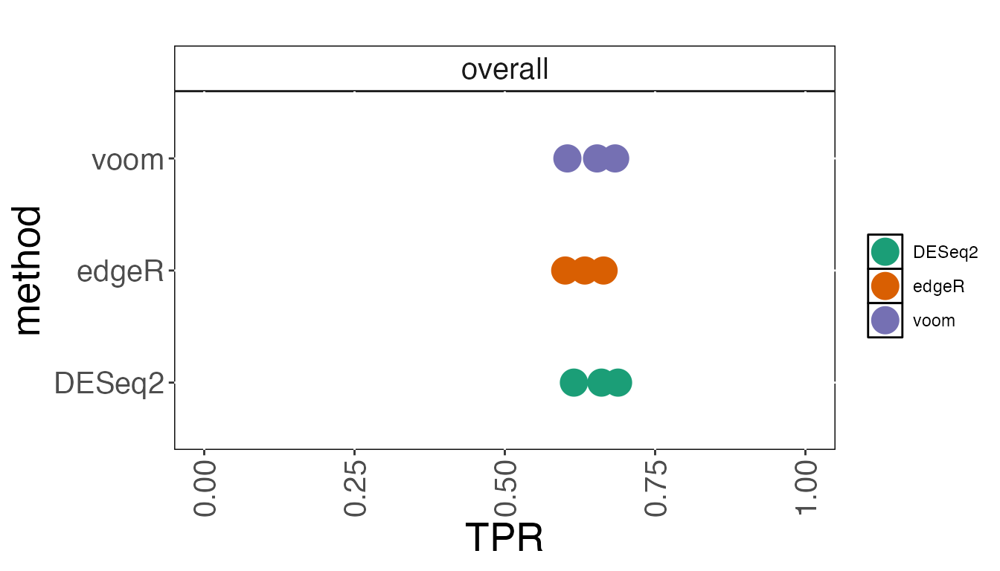
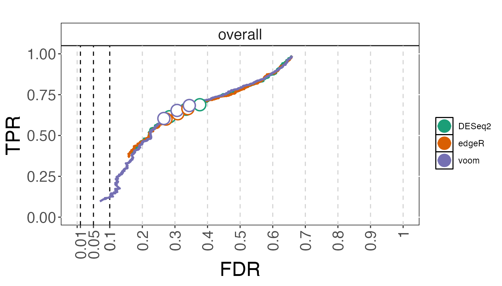
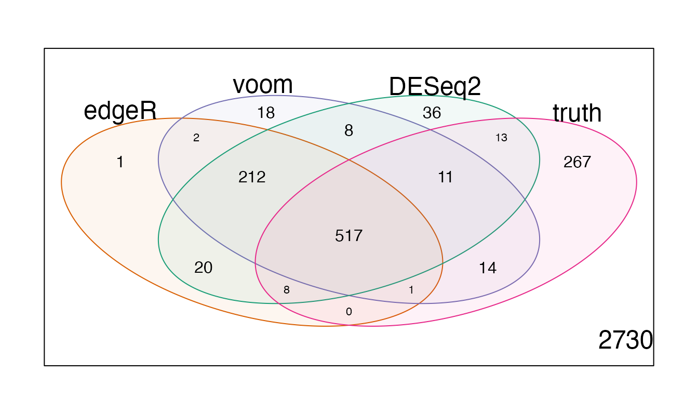
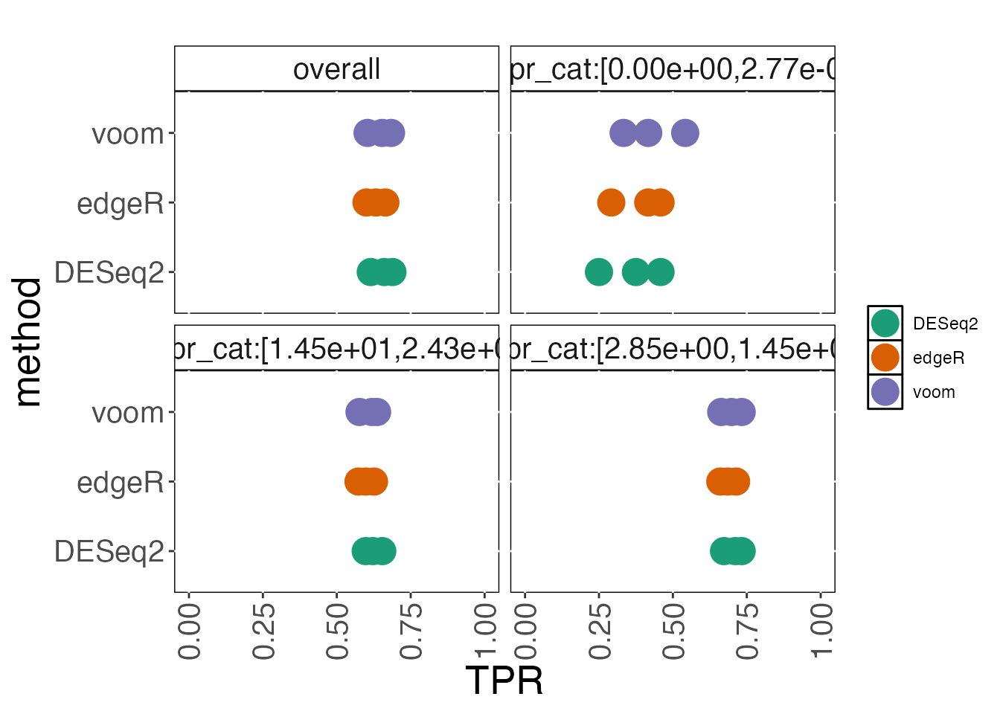
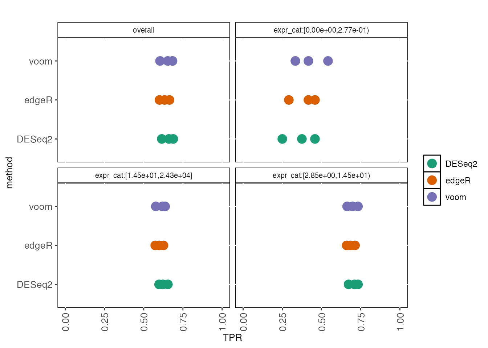
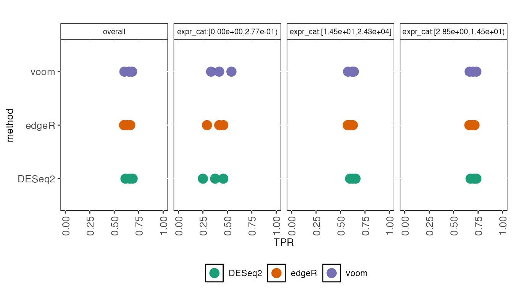
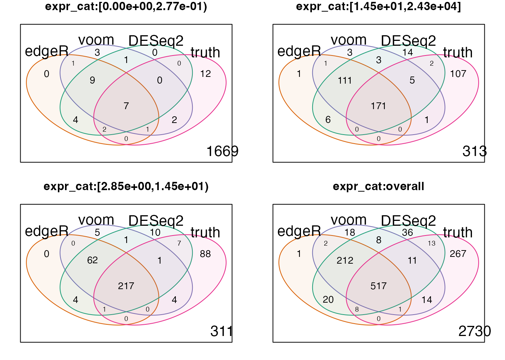
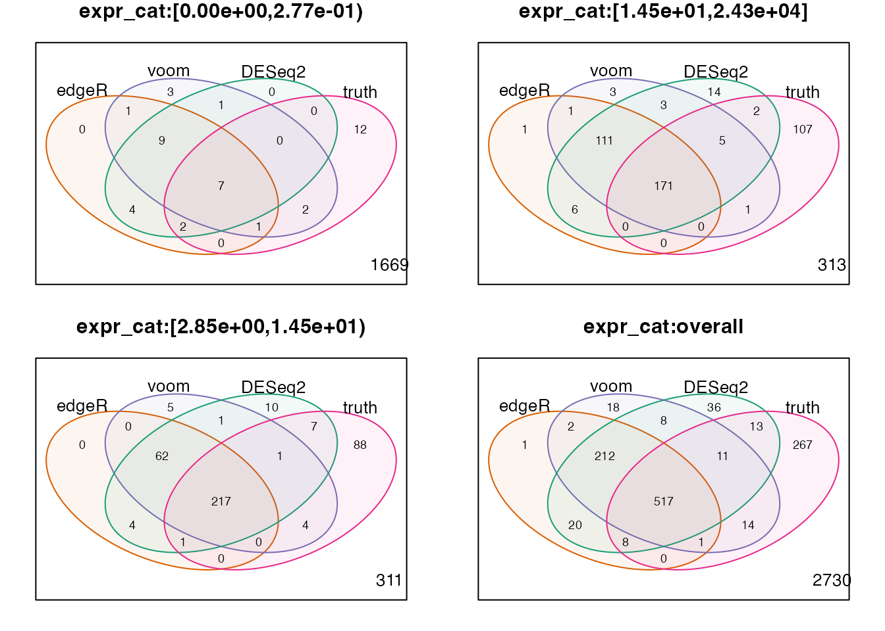
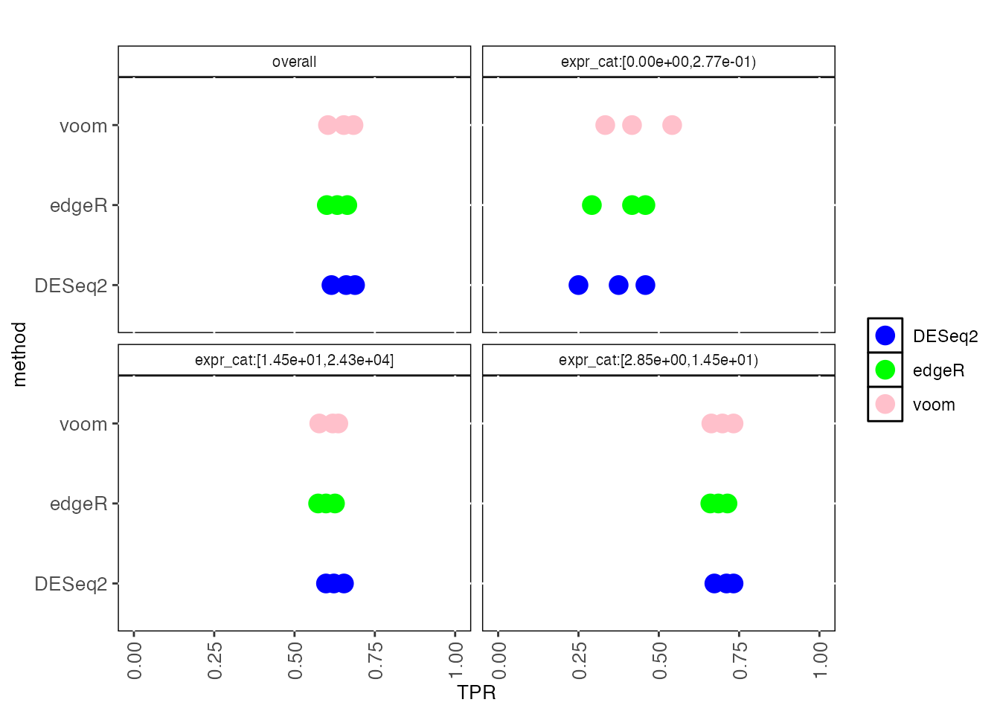
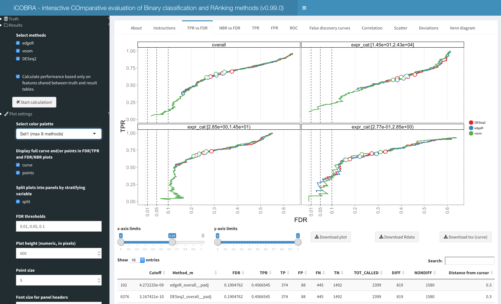

# iCOBRA User Guide

iCOBRA is a package to calculate and visualize performance metrics for
ranking and binary assignment methods. A typical use case could be, for
example, comparing methods calling differential expression in gene
expression experiments, which could be seen as either a ranking problem
(estimating the correct effect size and ordering the genes by
significance) or a binary assignment problem (classifying the genes into
differentially expressed and non-differentially expressed).

For more detailed information regarding the calculations, handling of
missing values etc, please consult the “Instructions” tab of the shiny
application, available via the function
[`COBRAapp()`](https://csoneson.github.io/iCOBRA/reference/COBRAapp.md).

## Basic workflow

### Creating a data set

The starting point for an evaluation is typically a collection of
feature ‘scores’ (p-values, adjusted p-values or any other ranking
score) and the truth (information about the true status, or the true
scores for the features). These values are stored in an `COBRAData`
object. Here, we will start from an example `COBRAData` object provided
with the package. Each slot in the `COBRAData` object should be a
`data.frame`, with row names representing feature IDs. The row names
will be used to match features across slots.

``` r
library(iCOBRA)
data(cobradata_example)
class(cobradata_example)
```

    ## [1] "COBRAData"
    ## attr(,"package")
    ## [1] "iCOBRA"

``` r
cobradata_example
```

    ## An object of class "COBRAData"
    ## @pval
    ##                        edgeR         voom       DESeq2
    ## ENSG00000000457 1.178024e-01 5.147484e-02 1.627063e-02
    ## ENSG00000000460 1.101413e-01 1.276784e-01 3.281416e-02
    ## ENSG00000000938 8.128245e-01 8.712829e-01 9.942761e-01
    ## ENSG00000000971 8.449686e-01 8.939493e-01 9.627826e-01
    ## ENSG00000001460 8.343203e-21 6.007010e-10 9.303159e-23
    ## 2394 more rows ...
    ## 
    ## @padj
    ##                        edgeR         voom
    ## ENSG00000000457 2.833295e-01 1.375146e-01
    ## ENSG00000000460 2.700376e-01 2.826398e-01
    ## ENSG00000000938 9.232794e-01 9.399669e-01
    ## ENSG00000000971 9.382227e-01 9.492325e-01
    ## ENSG00000001460 6.333969e-20 4.574862e-09
    ## 2394 more rows ...
    ## 
    ## @score
    ##                      edgeR       voom      DESeq2
    ## ENSG00000000457 0.22706080 0.23980596 0.274811698
    ## ENSG00000000460 0.31050478 0.27677537 0.359226203
    ## ENSG00000000938 0.04985025 0.03344113 0.001526355
    ## ENSG00000000971 0.03900847 0.02263371 0.008182751
    ## ENSG00000001460 3.81423112 4.18152876 3.741077290
    ## 2394 more rows ...
    ## 
    ## @truth
    ##                 status n_isoforms    logFC       logFC_cat       expr            expr_cat
    ## ENSG00000000457      0          5 0.000000 [ 0.000, 0.297)   8.525774 [2.85e+00,1.45e+01)
    ## ENSG00000000460      0         10 0.000000 [ 0.000, 0.297)   3.314544 [2.85e+00,1.45e+01)
    ## ENSG00000000938      0          8 0.000000 [ 0.000, 0.297)  11.543626 [2.85e+00,1.45e+01)
    ## ENSG00000000971      0          6 0.000000 [ 0.000, 0.297) 163.547797 [1.45e+01,2.43e+04]
    ## ENSG00000001460      1         13 3.939422 [ 3.540,24.063]   3.792523 [2.85e+00,1.45e+01)
    ## 3853 more rows ...

For the methods that don’t have adjusted p-values, we will calculate
adjusted p-values from nominal p-values.

``` r
cobradata_example <- calculate_adjp(cobradata_example)
```

    ## Adding empty sval slot to object

    ## Object up to date

### Calculating performance scores

Next, we calculate the performance scores using the COBRAData object. We
can perform both assignment-based and correlation-based evaluations, and
thus we have to provide information about which columns in the truth
data frame that are to be interpreted as the binary (assignment) truth
and continuous truth score, respectively. Here, we let the “status”
column (indicating the true differential expression status of the genes)
represent the true classification, and the true log-fold change
represent the true score, to which the observed scores will be compared.

``` r
cobraperf <- calculate_performance(cobradata_example, binary_truth = "status", 
                                  cont_truth = "logFC", splv = "none",
                                  maxsplit = 4)
```

    ## column edgeR is being ignored for FSR/NBR calculations

    ## column voom is being ignored for FSR/NBR calculations

    ## column DESeq2 is being ignored for FSR/NBR calculations

    ## column edgeR is being ignored for FSRNBR calculations

    ## column voom is being ignored for FSRNBR calculations

    ## column DESeq2 is being ignored for FSRNBR calculations

``` r
slotNames(cobraperf)
```

    ##  [1] "fdrtpr"      "fdrtprcurve" "fdrnbr"      "fdrnbrcurve" "fsrnbr"      "fsrnbrcurve"
    ##  [7] "deviation"   "tpr"         "fpr"         "roc"         "scatter"     "fpc"        
    ## [13] "overlap"     "corr"        "maxsplit"    "splv"        "onlyshared"

### Preparing performance object for plotting

After calculating the performance scores, we prepare the object for
plotting. In this step, we will assign colors to each of the methods,
and we can decide to keep only a subset of the methods. We also decide
whether the plotting should be done with or without facetting (i.e.,
splitting the plots into panels based on the stratification variable).
This choice will determine the number of colors that are needed to
distinguish between all method/stratification level combinations.

``` r
cobraplot <- prepare_data_for_plot(cobraperf, colorscheme = "Dark2", 
                                  facetted = TRUE)
```

### Plotting

When the data has been prepared for plotting, we can apply any of the
provided plot functions to visualize different aspects of the results.

``` r
plot_tpr(cobraplot)
```



``` r
plot_fdrtprcurve(cobraplot)
```



``` r
plot_overlap(cobraplot)
```



## Modifications to the basic workflow

### Stratification

All results can be stratified by any annotation provided in the truth
slot of the COBRAData object. Note that only the largest categories will
be retained (the number of retained categories is determined by the
maxsplit argument), and thus stratifying by continuous annotations is
not supported (each category would likely contain just one observation).
Here, we show how the stratification is performed, and how it changes
the plots generated above.

``` r
cobraperf <- calculate_performance(cobradata_example, binary_truth = "status", 
                                  cont_truth = "status", splv = "expr_cat")
```

    ## column edgeR is being ignored for FSR/NBR calculations

    ## column voom is being ignored for FSR/NBR calculations

    ## column DESeq2 is being ignored for FSR/NBR calculations

    ## column edgeR is being ignored for FSRNBR calculations

    ## column voom is being ignored for FSRNBR calculations

    ## column DESeq2 is being ignored for FSRNBR calculations

``` r
cobraplot <- prepare_data_for_plot(cobraperf, colorscheme = "Dark2", 
                                  facetted = TRUE)
plot_tpr(cobraplot)
```



### Modification of plots

The plotting functions (except plot_overlap) return ggplot objects. Some
basic settings (such as the size of the plot characters, the size of the
text in the panel headers and the axis ranges) can be set directly in
the plot functions. Others can be modified manually. For example, to
reduce the size of the axis labels, an appropriate theme can be added to
the ggplot object returned by the plot functions:

``` r
library(ggplot2)
pp <- plot_tpr(cobraplot, stripsize = 7.5, pointsize = 3)
pp + theme(axis.text.x = element_text(angle = 90, vjust = 0.5,
                                      hjust = 1, size = 10),
           axis.text.y = element_text(size = 10),
           axis.title.x = element_text(size = 10),
           axis.title.y = element_text(size = 10))
```



It is also possible to modify the facetting and/or label position by
adding a facet_wrap statement (note that the stratification variable is
denoted “splitval”):

``` r
pp + theme(axis.text.x = element_text(angle = 90, vjust = 0.5,
                                      hjust = 1, size = 10),
           axis.text.y = element_text(size = 10),
           axis.title.x = element_text(size = 10),
           axis.title.y = element_text(size = 10),
           legend.position = "bottom") +
  facet_wrap(~splitval, nrow = 1)
```



The plot_overlap function generates venn diagram(s), using the
vennDiagram function from the limma package. It can be provided with any
additional arguments that are accepted by limma::vennDiagram, e.g. to
change the size of the text:

``` r
plot_overlap(cobraplot)
```



``` r
plot_overlap(cobraplot, cex = c(1, 0.7, 0.7))
```



### Custom color assignment

The colors can either be chosen by one of the pre-defined color
palettes, or provided by the user as a character vector. Note that the
number of colors that are required depends on the facetting, and that
not all methods may be shown in all plots (depending on the provided
score types). If the wrong number of colors is provided, iCOBRA will
automatically add or remove colors.

``` r
cobraplot <- prepare_data_for_plot(cobraperf, 
                                  colorscheme = c("blue", "green", "pink"), 
                                  facetted = TRUE)
pp <- plot_tpr(cobraplot, stripsize = 7.5, pointsize = 3)
pp + theme(axis.text.x = element_text(angle = 90, vjust = 0.5,
                                      hjust = 1, size = 10),
           axis.text.y = element_text(size = 10),
           axis.title.x = element_text(size = 10),
           axis.title.y = element_text(size = 10))
```



### Interactive exploration

iCOBRA contains an interactive shiny application, for interactive
exploration of results. It can be called with an COBRAData object, or
with no arguments. In the latter case, results can be loaded into the
app from text files.

``` r
COBRAapp(cobradata_example)
COBRAapp()
```

Formatting instructions for the text files can be found in the
Instructions tab. To generate text files from an existing COBRAData
object, use the
[`COBRAData_to_text()`](https://csoneson.github.io/iCOBRA/reference/COBRAData.md)
function:

``` r
COBRAData_to_text(cobradata = cobradata_example, 
                  truth_file = "cobradata_truth.txt",
                  result_files = "cobradata_results.txt", 
                  feature_id = "feature")
```

Similarly, a COBRAData object can be generated from a set of text files,
using the
[`COBRAData_from_text()`](https://csoneson.github.io/iCOBRA/reference/COBRAData.md)
function:

``` r
cobra <- COBRAData_from_text(truth_file = "cobradata_truth.txt", 
                             result_files = "cobradata_results.txt", 
                             feature_id = "feature")
cobra
```

    ## An object of class "COBRAData"
    ## @pval
    ##                        edgeR         voom       DESeq2
    ## ENSG00000000457 1.178024e-01 5.147484e-02 1.627063e-02
    ## ENSG00000000460 1.101413e-01 1.276784e-01 3.281416e-02
    ## ENSG00000000938 8.128245e-01 8.712829e-01 9.942761e-01
    ## ENSG00000000971 8.449686e-01 8.939493e-01 9.627826e-01
    ## ENSG00000001460 8.343203e-21 6.007010e-10 9.303159e-23
    ## 2394 more rows ...
    ## 
    ## @padj
    ##                        edgeR         voom       DESeq2
    ## ENSG00000000457 2.833295e-01 1.375146e-01 4.760152e-02
    ## ENSG00000000460 2.700376e-01 2.826398e-01 8.717737e-02
    ## ENSG00000000938 9.232794e-01 9.399669e-01 9.985675e-01
    ## ENSG00000000971 9.382227e-01 9.492325e-01 9.868048e-01
    ## ENSG00000001460 6.333969e-20 4.574862e-09 6.742682e-22
    ## 2394 more rows ...
    ## 
    ## @sval
    ## data frame with 0 columns and 0 rows
    ## 
    ## @score
    ##                      edgeR       voom      DESeq2
    ## ENSG00000000457 0.22706080 0.23980596 0.274811698
    ## ENSG00000000460 0.31050478 0.27677537 0.359226203
    ## ENSG00000000938 0.04985025 0.03344113 0.001526355
    ## ENSG00000000971 0.03900847 0.02263371 0.008182751
    ## ENSG00000001460 3.81423112 4.18152876 3.741077290
    ## 2394 more rows ...
    ## 
    ## @truth
    ##                         feature status n_isoforms    logFC       logFC_cat       expr
    ## ENSG00000000457 ENSG00000000457      0          5 0.000000 [ 0.000, 0.297)   8.525774
    ## ENSG00000000460 ENSG00000000460      0         10 0.000000 [ 0.000, 0.297)   3.314544
    ## ENSG00000000938 ENSG00000000938      0          8 0.000000 [ 0.000, 0.297)  11.543626
    ## ENSG00000000971 ENSG00000000971      0          6 0.000000 [ 0.000, 0.297) 163.547797
    ## ENSG00000001460 ENSG00000001460      1         13 3.939422 [ 3.540,24.063]   3.792523
    ##                            expr_cat
    ## ENSG00000000457 [2.85e+00,1.45e+01)
    ## ENSG00000000460 [2.85e+00,1.45e+01)
    ## ENSG00000000938 [2.85e+00,1.45e+01)
    ## ENSG00000000971 [1.45e+01,2.43e+04]
    ## ENSG00000001460 [2.85e+00,1.45e+01)
    ## 3853 more rows ...

The screenshot below shows the appearance of the iCOBRA shiny app, using
the example data set.



## Session info

``` r
sessionInfo()
```

    ## R Under development (unstable) (2025-12-12 r89163)
    ## Platform: aarch64-apple-darwin20
    ## Running under: macOS Sequoia 15.7.2
    ## 
    ## Matrix products: default
    ## BLAS:   /System/Library/Frameworks/Accelerate.framework/Versions/A/Frameworks/vecLib.framework/Versions/A/libBLAS.dylib 
    ## LAPACK: /Library/Frameworks/R.framework/Versions/4.6-arm64/Resources/lib/libRlapack.dylib;  LAPACK version 3.12.1
    ## 
    ## locale:
    ## [1] en_US.UTF-8/en_US.UTF-8/en_US.UTF-8/C/en_US.UTF-8/en_US.UTF-8
    ## 
    ## time zone: UTC
    ## tzcode source: internal
    ## 
    ## attached base packages:
    ## [1] stats     graphics  grDevices utils     datasets  methods   base     
    ## 
    ## other attached packages:
    ## [1] ggplot2_4.0.0 iCOBRA_1.39.2
    ## 
    ## loaded via a namespace (and not attached):
    ##  [1] sass_0.4.10          generics_0.1.4       stringi_1.8.7        digest_0.6.38       
    ##  [5] magrittr_2.0.4       evaluate_1.0.5       grid_4.6.0           RColorBrewer_1.1-3  
    ##  [9] fastmap_1.2.0        plyr_1.8.9           jsonlite_2.0.0       limma_3.67.0        
    ## [13] gridExtra_2.3        promises_1.5.0       prompter_1.2.1       scales_1.4.0        
    ## [17] UpSetR_1.4.0         textshaping_1.0.4    jquerylib_0.1.4      shinydashboard_0.7.3
    ## [21] cli_3.6.5            shiny_1.11.1         rlang_1.1.6          withr_3.0.2         
    ## [25] cachem_1.1.0         yaml_2.3.10          otel_0.2.0           tools_4.6.0         
    ## [29] reshape2_1.4.5       dplyr_1.1.4          httpuv_1.6.16        DT_0.34.0           
    ## [33] ROCR_1.0-11          vctrs_0.6.5          R6_2.6.1             mime_0.13           
    ## [37] lifecycle_1.0.4      stringr_1.6.0        fs_1.6.6             htmlwidgets_1.6.4   
    ## [41] ragg_1.5.0           pkgconfig_2.0.3      desc_1.4.3           pkgdown_2.2.0.9000  
    ## [45] pillar_1.11.1        bslib_0.9.0          later_1.4.4          gtable_0.3.6        
    ## [49] glue_1.8.0           Rcpp_1.1.0           statmod_1.5.1        systemfonts_1.3.1   
    ## [53] xfun_0.54            tibble_3.3.0         tidyselect_1.2.1     knitr_1.50          
    ## [57] farver_2.1.2         xtable_1.8-4         htmltools_0.5.8.1    labeling_0.4.3      
    ## [61] rmarkdown_2.30       compiler_4.6.0       S7_0.2.0
