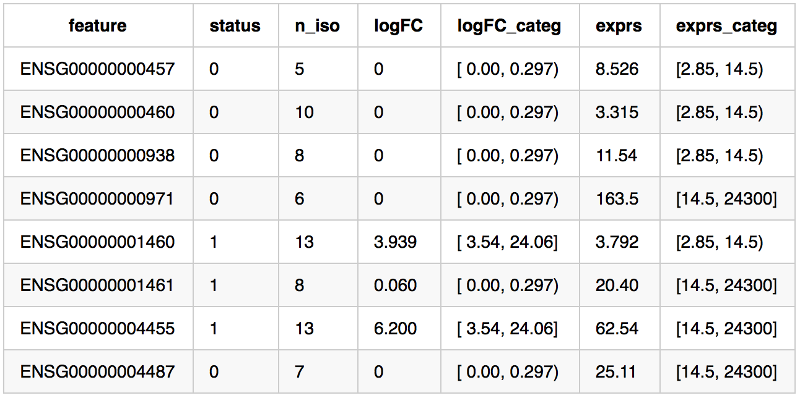
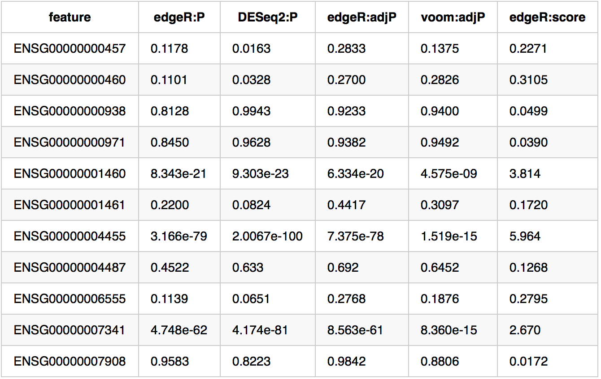
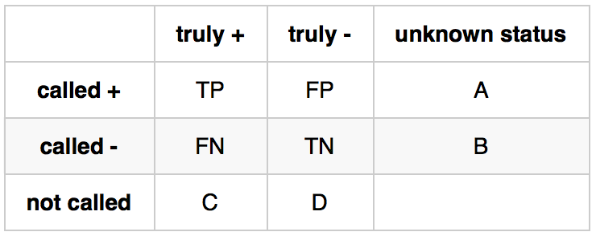

## Introduction
The `iCOBRA` interactive shiny application provides an easy-to-use, 
general-purpose benchmarking interface for comparing multiple methods 
in terms of their ability to correctly classify features in a (high-throughput) 
dataset as "positive" or "negative", as well as in terms of their ability to 
correctly estimate a continuous target. As an example, `iCOBRA` can be 
used to evaluate the performance of methods aimed at finding differentially 
expressed or differentially spliced genes between conditions, or to 
evaluate how well methods manage to estimate the (known) expression of a 
set of genes. The only formal requirements are that each evaluated method 
has assigned either (adjusted) p-values or a more general "score" (for 
example, the estimated expression level that will be compared to the true 
one) to each feature, and that the true status of the features to which 
the evaluated methods have been applied is known. The results can be 
visualized from different perspectives, using different metrics, and can 
also be stratified by feature attributes.

## Launching the application
The `iCOBRA` app can be launched in two modes:

- With an input object of the type `COBRAData`, generated by the `iCOBRA` R
package. This object contains data frames with calculated p-values, adjusted
p-values and/or scores, as well as a table of true values. When the application
is launched with an input object, all evaluations will be performed using the
data in that object. For more information about the `COBRAData` object type,
consult the corresponding help page in the `iCOBRA` R package.

- Without an input object, either from the `iCOBRA` R package or from the server
([http://imlspenticton.uzh.ch:3838/iCOBRA](http://imlspenticton.uzh.ch:3838/iCOBRA)).
In this case, all input data is uploaded in the form of text files containing
the truth and the results, respectively. These text files are described in more
detail in the next section. Note that the `iCOBRA` R package can be used to
convert between `COBRAData` objects and  correctly formatted text files (see
help pages for functions `COBRAData_to_text()` and `COBRAData_from_text()`)

## Input text files
If the `iCOBRA` app is launched without a data object, two types of input text 
files are necessary for the calculations to be performed:

- A "truth" file
- One or more "result" files for the evaluated methods

#### The truth file
The truth file is a tab-delimited text file (with a header line), listing all the 
features that were investigated (in rows), together with one or more attributes 
(in columns). The columns are of different types, and are used by the app for 
different purposes:

- One column contains the feature identifiers. By default, the application uses
the first column as identifiers, but this can be modified using the input
controls.
- (optional) One column containing a binary truth variable, encoding the true
classification of features into "positive" (encoded as 1) and "negative"
(encoded as 0). This can be, for example, the true differential expression
status if the features are genes. This column is only necessary to calculate the
metrics evaluating the binary classification of features (FDR/TPR, FDR/NBR, TPR,
FPR, ROC, FPC, overlap). By default, it is chosen as the first binary column in
the truth file, but this can be modified using the input controls. If binary
classification should not be evaluated, this can be set to "none".
- (optional) One column containing a continuous truth variable, encoding a
characteristic of the data that will be compared to the provided scores. This
can be, for example, the true expression of genes. This column is only necessary
to calculate the metrics based on comparing continuous scores (correlation,
scatter plots, deviations). By default, it is set to "none", since these metrics
may take slightly longer to calculate than the binary classification metrics.
This can be modified using the input controls.
- (optional) Additional columns containing categorical variables that can be
used to stratify the performance evaluation.

The table below shows the first lines of an example truth file. It contains the
columns **feature** (indicating the feature identifier), **status** (the true
binary assignment), **logFC** (the true continuous variable corresponding to the
scores calculated by the evaluated methods), as well as additional columns
representing stratification annotations.

#### The result files
The result files contain the p-values, adjusted p-values and scores for the
evaluated features. Each file can contain results obtained by one or multiple
methods. It is also possible to load multiple result files into the app. Each
result file must have a column corresponding to the feature identifier. This
column **must** have the same name as in the truth file. In order to correctly
interpret the other columns, each column header must be of the form
**method:type**, where **type** is either **adjP** (if the column contains
adjusted p-values or FDR estimates), **P** (if the column contains nominal 
p-values), or **score** (if the column contains a general score).

Nominal p-values will be adjusted by the app, using the Benjamini-Hochberg
correction method, as long as the adjusted p-values for the same method have not
been previously loaded or are part of the same result file as the p-values. The
part of the column name preceding the ":adjP", ":P" or ":score" will be
considered the "name" of the method. Please make sure that this name is unique
for each evaluated method. However, note that one or several types of columns
can be provided for the same method (e.g., we can provide both p-values,
adjusted p-values and a score with the same method name, and they will be
considered as different representations corresponding to the same method).

The table below shows the first lines of an example result file, containing
nominal p-values, adjusted p-values and scores for several methods. Missing
values (NA) are allowed.

### Use of different measure types
The combination of measures that are provided for a given method (P, adjP,
score) affects how the performance evaluation will be performed:

- Calculations of FDR, TPR, number of detections and FPRs at given adjusted
p-value thresholds are always calculated based on adjusted p-value inputs
(recall that these are calculated from p-values if they are not provided).
Methods for which adjusted p-values are not available will be excluded from
these evaluations.
- The full FDR/TPR and FDR/NBR curves, as well as ROC and FD curves, are
calculated from scores or p-values if provided (since these often have a higher
resolution than adjusted p-values). If not, adjusted p-values will be used. Note
that scores that are used for this purpose should be such that a higher score
corresponds to "more significant" features. For FDR/TPR and FDR/NBR curves, if
both scores/p-values and adjusted p-values are provided, it is necessary that
the scores/p-values and the adjusted p-values are monotonically related to each
other, otherwise the adjusted p-values will be used also for the curves. This is
to avoid discrepancies between the full curves and the values calculated at
specific adjusted p-value thresholds.
- The continuous evaluations (correlations, scatter plots and deviation plots)
are always based on provided scores. Methods for which a score column is not
provided are excluded from these evaluations.

### Handling missing features

Sometimes, not all features are assigned a score by each of the evaluated
methods. For example, some methods filter out variables for which they can not
perform reliable inference. Similarly, some features may not be present in the
truth table. This can be due to, for example, some inference methods generating
"new" features by combining original features. In this case, the true status for
the new features is not known. The table below tabulates the possible sets of
features in a data set. Features that are neither present in the result tables
nor in the truth table will not be considered.

The default settings of `iCOBRA` is to consider all features that are present
(with non-missing status) in the truth file. Thus, A = B = 0. In this case, all
features that are not called (i.e., where there are missing values in the result
table) will be considered negative ("not significant") and will thus be added to
the FN and TN, respectively, in the calculations of TPR and FPR. This is
motivated by the assumption that features are left out of the result table
because there was not enough evidence to call them significant. However, in some
circumstances it may mean that the given TPR and FPR values are slight
underestimates of the true values. Choosing to consider only features shared
between the truth and result table (by checking the box in the input controls)
will disregard features with missing values in the truth table such that also C
= D = 0. This will be done separately for each evaluated method. One exception
is made for the overlap plots (Venn diagrams and UpSet plots), which is the only
aspect that is interpretable even without a given truth (to evaluate agreement
between methods). For these, the following feature collections are used:

- When the checkbox for considering only shared features is not checked and the
truth is included in the Venn diagrams, all features where the (binary) truth is
available are used. Features with missing adjusted p-values are considered
non-significant.
- When the checkbox for considering only shared features is checked and the
truth is included, all features where the (binary) truth *as well* as the
adjusted p-value for *all* included methods are available are used.
- When the truth is not included, all features will be used. Features with
missing adjusted p-values are considered non-significant.

Note that this means that, for example, the value represented in the `Number of
detections` column in the FDR/NBR plots may differ from the total number of
calls in the Venn diagrams.

To summarise, the different columns shown in the information boxes below the
plots when hovering over a displayed point are defined as follows:

- Number of detections = TP + FP
- TPR = TP/(TP + FN + C)
- FPR = FP/(FP + TN + D)
- FDR = FP/(TP + FP)
- FP = FP
- TP = FP
- TN = TN
- FN = FN
- TOT_CALLED = TP + FP + FN + TN
- DIFF = TP + FN + C
- NONDIFF = FP + TN + D

## Comparison and evaluation methods
The `iCOBRA` application calculates several different types of comparison and
evaluation metrics, each represented in a separate tab. The available methods
are described briefly below.

- **TPR vs FDR plot**: This plot shows the observed false discovery rate vs the
observed true positive rate. If adjusted p-values are provided, it can be
calculated for a given set of adjusted p-value cutoffs. It can also be
calculated for each possible cutoff to generate an "FDR/TPR curve". Each point
in the plot represents one method and one cutoff, and points corresponding to
the same method are joined together. If "points" is selected to be displayed in
the input panel, and a method controls the FDR (that is, if the observed false
discovery rate is lower than or equal to the imposed cutoff), the corresponding
point is filled, otherwise it is open. The user can change the imposed adjusted
p-value cutoffs using the "FDR thresholds" input in the control panel in the
sidebar.
- **NBR vs FDR plot**: This plot is similar to the FDR vs TPR plot, but instead
of the TPR it shows the number of features classified as positive.
- **TPR plot**: This plot shows the observed true positive rate for one or more
adjusted p-value cutoffs. Each circle represents one method and one cutoff. The
user can change the imposed adjusted p-value cutoffs using the "FDR thresholds"
input in the control panel in the sidebar.
- **FPR plot**: This plot shows the observed false positive rate for one or more
adjusted p-value cutoffs. Each circle represents one method and one cutoff. The
user can change the imposed adjusted p-value cutoffs using the "FDR thresholds"
input in the control panel in the sidebar.
- **ROC curves**: This plot shows the ROC (receiver operating characteristic)
curves obtained by ranking features according to one of the provided measures
(scores if available, otherwise p-values, otherwise adjusted p-values), varying
the significance cutoff and calculating the true and false positive rate for
each cutoff value. A good method has a ROC curve that passes close to the upper
left corner, while a poorly performing method has a ROC curve that lies close to
the diagonal line. The user can zoom in to different parts of the ROC curve by
modifying the axis limits using the sliders below the plot.
- **False discovery curves**: This plot is obtained by ranking the features by
one of the provided measures (same order of prioritization as for ROC curves),
and counting the number of false positives among the top N features, for varying
values of N. The maximal value of N can be changed by the user.
- **Correlation**: This plot shows the correlation between the continuous truth
variable (defined by the user in the left-hand sidebar) and the scores for each
method. The user can choose between Pearson and Spearman correlation.
- **Scatter plots**: This plot depicts the observed scores against the
continuous truth variable (defined by the user in the left-hand sidebar), for
each method separately. Axes can be represented on a log-scale.
- **Deviation plots**: This plot shows the distribution of the deviation of the
observed scores from the continuous truth defined by the user. The distributions
can be shown as violin plots or regular box plots, with or without the
individual points overlaid. There is also an option to square the deviations or
take the absolute value before plotting. The use can zoom in by changing the
slider below the plot.
- **Venn diagram**: The sets of features classified as "positive" for up to five
methods (one of which can be the truth) can be compared using a Venn diagram.
The adjusted p-value cutoff for determining significance can be set by the user.
The user can also choose whether or not to include the truth in the Venn
diagram. If the truth is included, it will be considered as a "perfect" method,
assigning an adjusted p-value of 0 to all truly positive features, and an
adjusted p-value of 1 to all other features.
- **UpSet plots**: This type of plots also show the overlap among sets of genes,
but in a different way than the Venn diagrams. For more information see 
[Lex et al: UpSet: Visualization of Intersecting sets (IEEE Transactions on Visualization and Computer Graphics 20, 1983-1992 (2014))](http://ieeexplore.ieee.org/stamp/stamp.jsp?tp=&arnumber=6876017) or
[Lex & Gehlenborg: Points of view: Sets and intersections (Nature Methods 11, 779 (2014))](http://www.nature.com/nmeth/journal/v11/n8/full/nmeth.3033.html).

For all plots except Venn diagrams and UpSet plots, more information about a
given point can be obtained by hovering over the point in the plot. The
information will be displayed in a table below the plot. In this table it is
also possible to see which type of input measure (p-value, adjusted p-value or
score) that was used for each calculation.

## Input controls
Input controls are located in the sidebar as well as in the individual tabs. By
changing one or more of the input parameters, the user can get more precise
control of what is displayed. The following general parameters are available:

### Truth-related
- **Select column containing feature identifiers**: The name of the column in
truth and result text files that corresponds to the feature identifiers.
- **Select column containing binary truth**: The name of the column in the truth
text file or the provided `COBRAData` object that contains the binary truth
(classification) for the features.
- **Select column containing continuous truth**: The name of the column in the
truth text file or the provided `COBRAData` object that contains the continuous
truth for the features.
- **Select variable to stratify by**: If the truth table contains columns in
addition to the feature identifiers and the truth columns, these will be
considered as categorical annotations based on which the results can be
stratified. This dropdown menu will automatically appear and be populated with
the available columns from the truth table.
- **Maximum number of levels to show when stratifying**: The maximum number of
categories to include if the results are stratified by a variable annotation.
The most frequent categories containing both positive and negative instances
will be included.
- **Include 'overall' class when stratifying**: Whether or not the overall
results are retained  as one category when the results are stratified by a
variable annotation.
- **Show curve and/or points in FDR/TPR plots**: Whether to include full curves
and/or points (for given adjusted p-value thresholds) in FDR/TPR and FDR/NBR
plots.

### Result-related

- **Select methods**: A list of methods for which the result files provide
results. This list will be automatically populated, and augmented if new result
files are loaded. Methods can be selected or deselected to include or exclude
them from the result visualizations.
- **Calculate performance based only on features shared between truth and result
tables**: In some applications, some methods may not return results for all the
features for which we know the true status (e.g., due to filtering). Similarly,
the result tables may contain "new" features for which we don't know the true
status (e.g., due to merging of original features into complexes). By default,
all features available in the truth table will be included in the evaluations.
If this box is checked, only features shared between the truth table and each
method will be retained (see also above).

### General plot-related
- **Select color palette**: Select the color palette that will be used to define
colors for the different methods. Some palettes are only applicable if the
number of required colors is below a certain threshold. If this threshold is
exceeded, the `hue_pal` palette will be used. Note that the number of required
colors may be larger than the number of methods, e.g., if results are stratified
by an annotation but all strata are shown in the same panel (and thus each
method/stratum combination needs a unique color), or if the truth is included as
a method in the Venn diagram.
- **Display full curve and/or points in FDR/TPR and FDR/NBR plots**: In the
FDR/TPR and FDR/NBR plots, the user can choose to include one or both of a
limited number of points (results calculated at given adjusted p-value
thresholds), or to show the entire curve (considering all thresholds). Note that
the points will only be calculated if adjusted p-values are provided.
- **Split plots into panels by stratifying variable**: Whether to split the
plots into panels based on the stratifying variable, or to show all results in
the same panel.
- **FDR thresholds**: The adjusted p-value cutoffs that are used for the
FDR/TPR, FDR/NBR, FPR and TPR plots. One or more thresholds (in the interval [0,
1]) can be chosen. Multiple thresholds must be separated by commas.
- **Plot height**: The height of the plots (a numeric value, giving the height
in pixels).
- **Point size**: The size of the plot characters.
- **Font size for panel headers**: If the plots are split into panels, this
number gives the font size used in the panel headers.

### Specific plot-related
- **Axis limits**: In most plot types, the axis limits can be set using sliders.
- **Download plot**: Download the current plot in pdf format.
- **Download Rdata**: Download the `COBRAPlot` object containing all results
needed for plotting (see the `iCOBRA` R package for details).
- **Download tsv**: Download a tab-separated file with the values shown in the
plot.
- **Maximal rank to display** (False discovery curves): The largest number of
"top features" shown in the false discovery plots (that is, the upper x-axis
limit).
- **Correlation measure** (Correlation): Either Pearson or Spearman, the type of
correlation shown in the plot.
- **Flip axes** (Scatter plots): Flip the x- and y-axes.
- **Log-transform** (Scatter plots): Log-transform the x- and y-axes.
- **Include jittered points** (Deviations): In addition to showing the overall
distribution of values, include the individual points, with jittering to avoid
overplotting.
- **Transformation** (Deviations): How to transform the deviations before
plotting. Either raw, absolute or squared.
- **Plot type** (Deviations): Whether to show the distribution of deviations as
a violin plot or a regular box plot.
- **Include truth** (Venn diagram, applies also to UpSet plots): Whether or not
the truth should be considered as a (perfect) method in the Venn diagrams. If
yes, the "truth" method will be considered to assign an adjusted p-value of 0 to
all truly "positive" features, and an adjusted p-value of 1 to the truly
"negative" ones.
- **Type of threshold** (Venn diagram, applies also to UpSet plots): Whether to
define "significant features" by thresholding the adjusted p-value or the rank
(e.g., considering the top-ranked N features by each method, ranked by adjusted
p-value).
- **Adjusted p-value threshold** (Venn diagram, applies also to UpSet plots):
The adjusted p-value threshold that will be used to classify features as
positive or negative when threshold type is "adjp". The collections of positive
features from different methods are compared in the Venn diagrams and UpSet
plots.
- **Rank threshold** (Venn diagram, applies also to UpSet plots): The rank
threshold that will be used to classify features as positive or negative when
threshold type is "rank". The collections of positive features from different
methods are compared in the Venn diagrams and UpSet plots.
- **Select category** (UpSet plots): If the results are stratified by some
variable, these plots can only be generated for one level at a time. With this
input control, you select which level is displayed.
- **Order intersections by** (UpSet plots): You can choose whether to order the
intersections by degree (number of sets involved in the intersection) or by
frequency (number of elements in the intersection).
- **Order intersections** (UpSet plots): Choose whether to order the
intersections by increasing or decreasing values of the degree or frequency.

## Trouble-shooting

If the plots are not displayed, it can be for one of the following reasons:

- The app has been called with `autorun = FALSE` (default), and the button
"Start calculation!" has not been pressed.
- The input files are not correctly formatted (e.g., the column headers of the
result file do not end with `:P`, `:adjP` or `:score`). Check the "Data preview"
tab to see the data that `iCOBRA` has extracted from the input files.
- No methods are selected (check under the "Results" subsection in the left-hand
sidebar), or none of the selected methods contain the type of input needed for
the current plot (e.g., adjusted p-values for FDR/TPR, FDR/NBR, TPR and FPR
plots, scores for correlation, deviation and scatter plots). Check the "Data
preview" tab to see the data that `iCOBRA` has extracted from the input files.
- The right type of truth (binary or continuous) is unavailable or not selected.
Check under the "Truth" subsection in the left-hand sidebar that the truth is
not set to "none", and check the "Data preview" tab to see the data that
`iCOBRA` has extracted from the input files.
- More than five methods (including the truth, if applicable) can not be
displayed using Venn diagrams.
- For stratification, only strata with both truly "positive" and truly
"negative" instances will be included (except for Venn diagrams).
- If UpSet plots are not showing it may be because all intersections (for a
specific level of the stratification factor) are empty.

If not all input controls are visible in the left-hand sidebar, either "fold"
one of the three sections (Truth, Results, Plot settings) by clicking on the
corresponding title, or change the size of the window slightly.

The sidebar can be hidden by clicking on the three lines next to the main title.

If the colors of the plots do not change when a new color palette is chosen in
the left-hand sidebar, most likely the number of colors in the chosen palette is
not enough. Note that the number of required colors depends not only on the
number of different methods in the evaluation, but also on whether the plots are
facetted or not, and whether the truth is included or not. Also note that not
all methods may be included in each plot, so the number of methods that need to 
be assigned a unique color may exceed the number of methods displayed in any
given plot. `iCOBRA` will attempt to keep the colors for a given method
consistent throughout the different visualizations.

