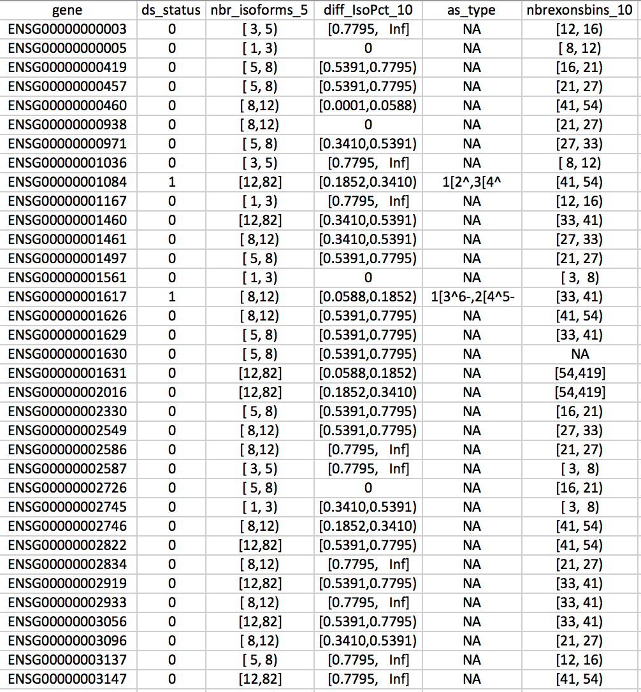
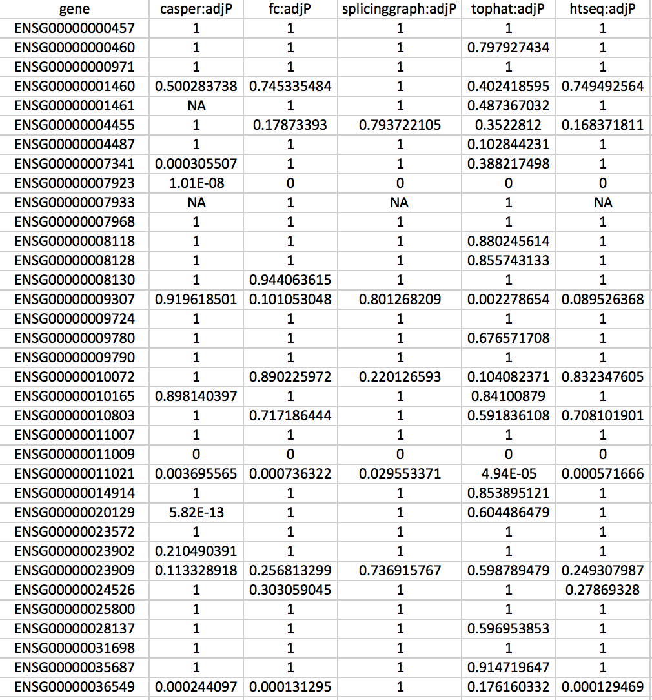

## Introduction
The goal of this application is to provide an easy-to-use, general-purpose benchmarking interface where users can compare multiple methods in terms of their ability to detect "truly differential" variables in a high-throughput dataset. For example, we can evaluate the performance of methods aimed at finding differentially expressed or differentially spliced genes between conditions. The only formal requirements are that the evaluated methods return a p-value or adjusted p-value (or FDR estimate) for each variable, and that we know the true status of each of the variables to which the evaluated methods are applied. The results can be visualized from different perspectives, using different metrics, and can also be stratified by different variable attributes.

## Input files
Two input files are necessary for this application to work:
- A "truth" file
- One or more "result" files for the evaluated methods

#### The truth file
The truth file is a tab-delimited text file (with a header line), listing all the genes that were investigated (in rows), together with one or more attributes (in columns). Please note that the column name of the column containing the gene identifiers **must** be *gene*. The only other mandatory column is one with column name *ds_status*, which indicates the true status of the genes. The values in this column must be either 0 (indicating truly non-differential) or 1 (indicating truly differential). Additional columns can contain other characteristics of the genes. These columns can be used to stratify the evaluations to subcategories. Note that in this version, only categorical attributes are supported, and that only the most frequent categories will be displayed (the number of displayed categories can be set by the user).

The screenshot below shows the first lines of an example truth file. Here, we have the mandatory columns *gene* and *ds_status*, as well as several other columns encoding additional properties of the genes.

#### The result files
The result files contain the p-values or adjusted p-values (or similar), or a more general "score" for each of the analyzed genes. A result file can contain results for one or more methods. It is also possible to load multiple result files. In order to correctly interpret the column content, each column name must end with either **:adjP** (if the column contains adjusted p-values), **:P** (if the column contains p-values), or **:score** (if the column contains a general score, where a larger value corresponds to a more significant gene). Nominal p-values will be adjusted by the app, using the Benjamini-Hochberg correction method, as long as the adjusted p-values for the same method have not been previously loaded or are part of the same result file as the p-values. The part of the colum name preceding the ":adjP", ":P" or ":score" will be considered the "name" of the method. Please make sure that this name is unique, otherwise only the first one will be included in the results. 

The screenshot below shows the first lines of an example results file, containing the adjusted p-values for several methods. Note that not all genes are given a result by each of the methods. 

Note also that when a new method is added to the analysis, or when the stratification annotation is changed, the results are recalculated, which can take some time. A progress box in the top right corner shows what is happening.

The combination of measures that are provided for a given method (P, adjP, score) affects how the performance evaluation will be performed. FDR, TPR, number of detections and FPRs at given adjusted p-value thresholds are always calculated based on adjusted p-value inputs (recall that these are calculated from p-values if they are not provided). The full FDR/TPR and FDR/NBR curves, as well as ROC and FD curves, are calculated from scores or p-values if provided (since these often have a higher resolution than adjusted p-values). For FDR/TPR and FDR/NBR curves, if both score/p-value and adjusted p-values are provided, it is necessary that the score/p-value and the adjusted p-values are monotonically related to each other, otherwise the adjusted p-values will be used also for the curves. 

## Comparison and evaluation methods
The app features several different types of comparison and evaluation methods, each represented in a separate tab. The available methods are described briefly below. Note that you can also click in the respective plots to get some more information about how to interpret them.

- **FDR vs TPR plot**: This plot shows the observed false discovery rate vs the observed true positive rate for one or more adjusted p-value cutoffs. Each point represents one method and one cutoff, and points corresponding to the same method are joined together. If "points" is selected to be displayed in the input panel, and a method controls the FDR (that is, if the observed false discovery rate is lower than or equal to the imposed cutoff), the corresponding point is filled, otherwise it is open. The user can change the imposed adjusted p-value cutoffs using the "FDR thresholds" input in the left-hand control panel. If the results are split by a variable annotation, the different method/category combinations will be represented as different methods. If only one FDR threshold is chosen, and if the results are split by a variable annotation, the points corresponding to the same method (across the different annotation categories) will be joined together.
- **FDR vs NBR plot**: This plot is similar to the FDR vs TPR plot, but instead of the TPR it shows the number of methods called significant at a given FDR threshold, against the observed false discovery rate. 
- **TPR plot**: This plot shows the observed true positive rate for one or more adjusted p-value cutoffs. Each circle represents one method and one cutoff. The user can change the imposed adjusted p-value cutoffs using the "FDR thresholds" input in the left-hand control panel. If the results are split by a variable annotation, one panel will be created for each retained category. 
- **ROC curves**: This plot shows the ROC (receiver operating characteristic) curves obtained by ranking genes by their adjusted p-value, varying the significance cutoff and calculating the true and false positive rate for each cutoff value. A good method (one that assigns low p-values to truly differentially spliced genes and high p-values to truly non-differential genes) has a ROC curve that passes close to the upper left corner, while a poorly performing method has a ROC curve that lies close to the diagonal line. Note that since many variables are often assigned an adjusted p-value of 1, the upper right part of the ROC curve may be less informative. The user can change the maximal FPR value to show (that is, the upper limit of the x-axis) with the input controls, in order to focus on the beginning of the ROC curve.
- **False discovery curves**: These plots are obtained by ranking the genes by significance, and counting the number of false positives among the top N genes, for varying values of N. The maximal value of N can be changed by the user (Maximal rank in false discovery plots). 
- **Venn diagram**: The sets of differential genes for up to five methods (one of which can be the truth) can be compared using a Venn diagram. The adjusted p-value cutoff for determining significance can be set by the user. The user can also choose whether or not to include the truth in the Venn diagram. If the truth is included, it will be considered as a "perfect" method, assigning an adjusted p-value of 0 to all truly differential genes, and an adjusted p-value of 1 to all other genes. The Venn diagram will not be displayed if the results are stratified by some variable annotation.

## Input controls
By changing one or more of the input parameters in the left-hand control panel, the user can get more precise control of what is shown in the plots. The following parameters are available:

- **Select variable to split by**: If the uploaded truth file contains columns in addition to the mandatory "gene" and "ds_status" columns, these will be considered as categorical annotations based on which the results can be stratified. This dropdown menu will automatically appear and be populated with the available columns from the uploaded truth file.
- **Include 'overall' class when stratifying**: Whether or not the overall results are retained when the results are stratified by a variable annotation.
- **Show curve and/or points in FDR/TPR plots**: Whether to include lines (full curves) and/or points (for given q-value thresholds) in FDR/TPR and FDR/NBR plots.
- **Facet FDR/TPR plots**: Whether to facet the FDR/TPR, FDR/NBR, ROC and FDC plots when results are stratified by a variable annotation. If not selected, the stratified results are shown in the same panel.
- **FDR thresholds**: The adjusted p-value cutoffs that are used for the FDR vs TPR plot and the FDR vs NBR plot. One or more thresholds (in the interval [0, 1]) can be chosen. Multiple thresholds must be separated by commas. 
- **Point size**: The size of the circles in the FDR vs TPR plot, the FDR vs NBR plot and the TPR plot.
- **Max FDR to show**: The maximal FDR to show on the x-axis in the FDR vs TPR plot and the FDR vs NBR plot (that is, the upper x-axis limit). By default, it is 1 (that is, all values are shown). It can be useful to change this if one wants to "zoom in" on a region of interest. Points falling outside of the range will not be shown. 
- **Max FPR to show in ROC curve/FPR plot**: The maximal FPR to show on the x-axis in the ROC curve plot. The default is 1 (that is, the whole ROC curve is shown). Lowering this value allows to zoom in on the left-hand side of the ROC curve.
- **Maximal rank in false discovery plots**: The largest number of "top genes" shown in the false discovery plots (that is, the upper x-axis limit). 
- **Maximum number of categories to show**: The maximum number of categories to include if the results are split by a variable attribute. The most frequent categories will be included. 
- **Include truth in Venn diagrams**: Whether or not the truth should be considered as a (perfect) method in the Venn diagrams. If yes, the "truth" method will be considered to assign an adjusted p-value of 0 to all truly differentially spliced genes, and an adjusted p-value of 1 to the others. 
- **Adjusted p-value threshold for Venn diagram**: The adjusted p-value threshold that will be used to classify genes as significant or non-significant. The collections of significant genes from different methods will be compared in the Venn diagram. 
- **Plot height**: The height of the different plots (a numeric value, giving the height in pixels). 
- **Select methods**: A list of methods for which the result files provide results. This list will be automatically augmented as new result files are loaded. Methods can be selected or deselected to include or exclude them from the result visualizations. 

## Changelog
- May 20, 2015: First version available.
- June 5, 2015: Fixed a bug that reversed the direction of the ROC curves. Added the option to choose the x-axis range in the ROC curves. Added the feature that points are joined together for each method in FDR vs TPR and FDR vs NBR plots, if only one FDR threshold is selected and the results are split by a variable annotation.
- July 19, 2015: Added interactivity to FDR/TPR and FDR/NBR plots, to show the points hovered over with the mouse.
- August 2, 2015: Added full FDR/TPR and FDR/NBR curves, as well as facetted ROC and FD curves. 

